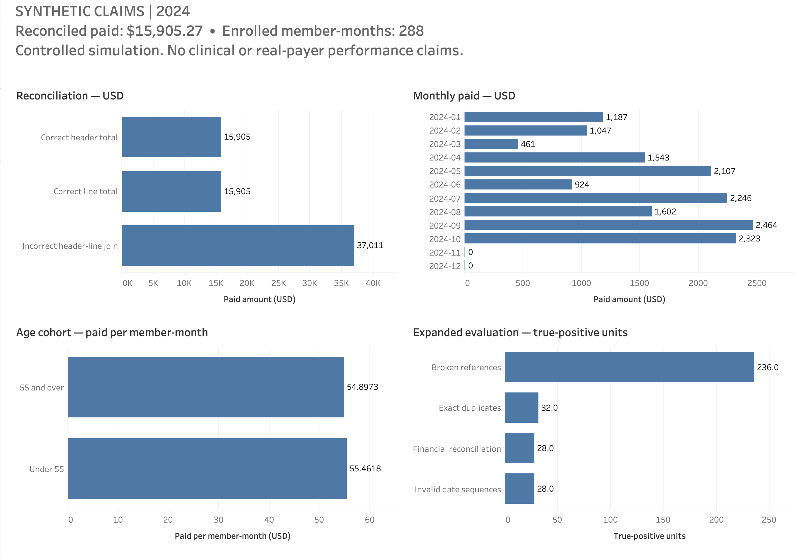

# Healthcare Claims Quality & Financial Reconciliation

**A claims reporting pipeline can produce entirely plausible financial totals that are wrong.** This project builds the validation and reconciliation controls that catch that before the numbers reach a report.

**All data are synthetic.** No real members, providers, patient information, payer or employer data, or genuine healthcare coding are used.

## Key finding

On the baseline fixture, summing header payments after joining to claim lines reports **$37,011.02**, while the reconciled payment total is **$15,905.27** — an overstatement of **$21,105.75 (132.70%)**.

That difference is a **reporting distortion caused by incorrect grain handling** in synthetic data, not employer savings or a production result.

## Dashboard



*Tableau dashboard summarizing financial reconciliation, monthly paid amounts, cohort PMPM, and validation results from the controlled synthetic claims analysis.*

Every plotted value reconciles to the validated source results. Open `dashboard/Claims_Quality_Public.twbx` in Tableau Desktop or Tableau Public to explore it — the package carries its own extract, so no account or upload is required. See the [dashboard notes](dashboard/README.md) for units and interactions.

## Why claims grain matters

A claim has one header carrying its payment, and one or more service lines beneath it. Joining headers to lines repeats the header's payment on every matching row. Summing after that join produces a total at the wrong grain.

Nothing errors. The query runs, the number is larger, and it looks reasonable. Without an independent reconciliation check, it ships.

## Reconciliation controls

Three independent paths agree on the correct total: summing at header grain, summing line payments, and aggregating lines to one claim row before joining. **That agreement is the control** — comparing the suspect result against an independent ledger is what catches the error.

`SUM(DISTINCT paid_cents)` is *not* a valid correction, because separate claims can legitimately share a dollar amount.

Alongside reconciliation, DuckDB SQL checks cover exact duplicate records, broken foreign keys, and invalid date sequences. Detection reads only raw tables — the expected-defect manifest is held in separate modules and files that detection never touches, so the evaluation cannot mark its own homework. The scenario set also includes valid lookalike cases that resemble defects but are legitimate, which tests over-flagging as well as missed defects.

## Reporting implication

Establish the reporting grain and the reconciliation checks *before* publishing payment totals. Route quality flags to source investigation rather than deleting or silently repairing records.

Quality output here is an investigation queue. Nothing is auto-corrected, no money is recovered, and dirty data never feeds the business metrics — analytics run only on the validated clean baseline.

## Data model

| Table | Declared business grain |
|---|---|
| `members` | One row per member_id |
| `providers` | One row per provider_id |
| `enrollment` | One row per enrollment_id |
| `claim_headers` | One row per claim_id |
| `claim_lines` | One row per claim_id + line_number |

`record_id` is a physical source-row identifier used for traceability, deliberately excluded from business-record duplicate comparison. Money is **integer cents** throughout — float arithmetic does not reconcile exactly, and exact reconciliation is the entire point. The fixture assumes allowed = paid + patient, billed ≥ allowed, non-negative amounts, and exact header-to-line totals.

An **exact duplicate** repeats every business field including identifiers, and all occurrences are flagged — no arbitrary "first row" is assumed correct. Different claim IDs with identical apparent services are *potential duplicate services requiring review*, not exact-record errors.

See the [data dictionary](docs/DATA_DICTIONARY.md) and [metric definitions](docs/METRIC_DEFINITIONS.md).

## Methodology

The generator produces a clean baseline, validates invariants against it independently, then injects controlled defects into copies while writing an isolated manifest of what it changed. SQL detection runs against the raw tables; evaluation compares detections to the manifest afterwards. Utilization and cohort analytics run only on the validated clean baseline.

Utilization uses explicit enrollment denominators. Member-months count distinct enrolled member/calendar-month combinations, so overlapping coverage cannot double-count. Cohort rates are recomputed as summed numerator over summed denominator — never an unweighted average of two rates.

Further detail: [architecture](docs/ARCHITECTURE.md), [technical notes](docs/TECHNICAL_NOTES.md), [validation protocol](docs/VALIDATION.md).

## Reproduce

Requires Python 3.11 or newer. Tested on macOS arm64 with Python 3.11.5; other platforms are unverified. No cloud account or database service is needed.

```sh
python3 -m venv .venv
.venv/bin/python -m pip install -r requirements-dev.txt
.venv/bin/python -m pytest -q
PYTHONPATH=src .venv/bin/python -m claims_quality run --seed 17 --scenario standard --out work/run-17
```

`run` produces the clean and dirty datasets, the isolated ground truth, detector flags, an `ISSUES.md` review queue, evaluation metrics, join analytics and a deterministic `run.json`. An existing output directory is refused, so a rerun cannot silently overwrite a previous one.

Installing the package works outside the source checkout, since the SQL resources are bundled:

```sh
.venv/bin/python -m pip install .
.venv/bin/claims-quality run --seed 101 --scenario stress --out work/run-101
.venv/bin/claims-quality review --flags work/run-101/flags.json --out work/run-101/REVIEW.md
```

`review` reads detector flags only. It groups multiple checks on the same record and explains investigation steps without consulting labels.

Reports contain no timestamps, so identical inputs produce byte-identical outputs. To rebuild the Tableau inputs, install the optional extra with `pip install '.[tableau]'` and run `claims-quality dashboard` followed by `claims-quality tableau-extract`.

## Validation

Automated checks cover injected-defect detection, claim-level relationships and foreign-key integrity, financial reconciliation, utilization and cohort metrics, Tableau extract fidelity, and reproducible installation. A separate set runs against the installed package outside the checkout.

The expanded evaluation runs 18 controlled scenarios across 4 seeds. Held-out seeds vary amounts, dates and defect placement, but do not introduce novel defect mechanisms — so controlled scores are **not** estimates of real-world payer accuracy.

Full detail and the reconciled figures: [validation summary](reports/VALIDATION_SUMMARY.md), [measured results](reports/RESULTS.md), [expanded evaluation](reports/expanded/EXPANDED_RESULTS.md), [executive brief](reports/EXECUTIVE_BRIEF.md).

## Limitations

The fixture is small and deterministic by design, so every expected result can be verified exactly. **It is not a scale claim.**

November and December show zero claims because the generator limits service starts to the first 300 days of 2024. That is a property of the fixture, not a seasonal pattern, and must not be read as one. Apparent cohort, provider or monthly differences are likewise generator artifacts.

Claims are not visits, and these outputs should never be relabeled as visit counts. Payment lags are fixed rather than modeled. No real medical adjudication, payer rules, clinical validation, fraud detection, or real-world model performance is represented.

See [limitations](docs/LIMITATIONS.md) for the full list.
