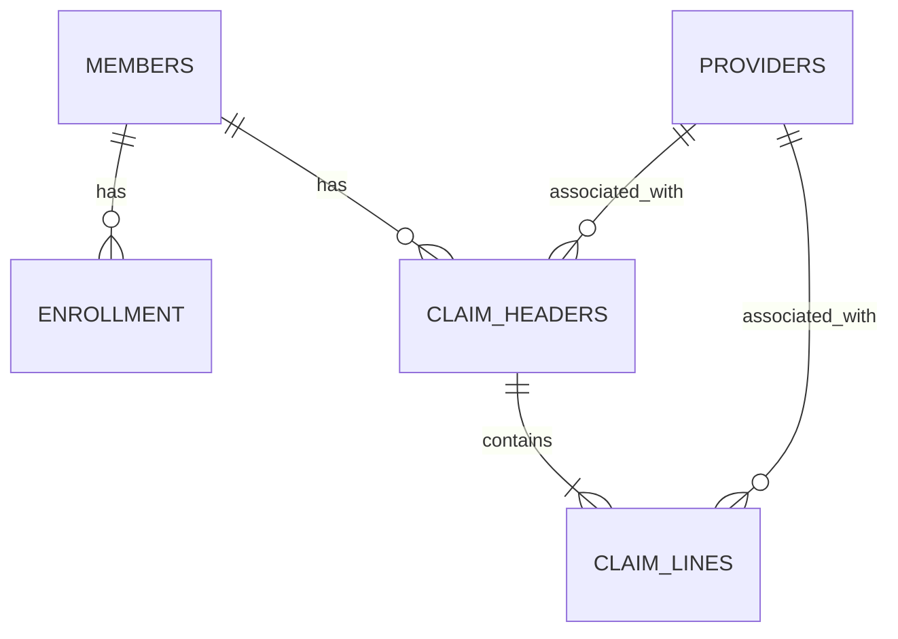

# Schema, grain and dictionary

## Global conventions

All columns are required. Missing columns, nulls, unparseable types and duplicate physical `record_id` values fail ingestion rather than producing one of the four quality categories. Dates use ISO `YYYY-MM-DD` with no times/time zones. IDs and codes are opaque text; leading zeroes matter. Each table's `record_id` is unique within that table, not a healthcare identifier. Keys refer to declared clean-business grain; raw staging intentionally does not enforce those keys, allowing dirty records to load.

The detector imposes no “current date” dependency. It evaluates ordering, not timeliness relative to today. The synthetic service period is calendar year 2024. Every generated baseline member has one full-year enrollment span. No personal names, addresses or contact details are generated.

## members

| Field | DuckDB type | Meaning |
|---|---|---|
| record_id | VARCHAR | Physical row ID, primary key in staging |
| member_id | VARCHAR | Declared business key; synthetic member |
| birth_date | DATE | Synthetic birth date; must not follow a linked header's service start |

## providers

| Field | Type | Meaning |
|---|---|---|
| record_id | VARCHAR | Physical row ID |
| provider_id | VARCHAR | Declared business key; invented ID, not NPI |
| provider_type | VARCHAR | Illustrative SYN_CLINIC or SYN_LAB; not a validated taxonomy |

## enrollment

| Field | Type | Meaning |
|---|---|---|
| record_id | VARCHAR | Physical row ID |
| enrollment_id | VARCHAR | Declared business key |
| member_id | VARCHAR | Foreign key to members.member_id |
| start_date | DATE | Inclusive coverage start |
| end_date | DATE | Inclusive coverage end; must be >= start_date |

Baseline validation additionally checks that services fall within generated coverage. Detector coverage eligibility, overlapping enrollment and plan benefits are explicitly deferred: membership existence and date ordering are the release-1 checks.

## claim_headers

| Field | Type | Meaning |
|---|---|---|
| record_id | VARCHAR | Physical row ID |
| claim_id | VARCHAR | Declared business key |
| member_id | VARCHAR | Foreign key to members.member_id |
| provider_id | VARCHAR | Foreign key to providers.provider_id; header provider role is simplified |
| service_start | DATE | Inclusive first service day |
| service_end | DATE | Inclusive last service day |
| received_date | DATE | Synthetic receipt date; >= service_end under this fixture |
| paid_date | DATE | Synthetic processing/payment date; >= received_date even when paid is zero |
| billed_cents | BIGINT | Sum of line billed cents |
| allowed_cents | BIGINT | Sum of line allowed cents |
| paid_cents | BIGINT | Sum of line payer-payment cents |
| patient_cents | BIGINT | Sum of illustrative line patient-responsibility cents |

The date ordering is a project contract, not a claim that every real data feed uses these semantics. There are no revisions, adjustments or partial-payment events.

## claim_lines

| Field | Type | Meaning |
|---|---|---|
| record_id | VARCHAR | Physical row ID |
| claim_id | VARCHAR | Foreign key to claim_headers.claim_id; part of composite business key |
| line_number | INTEGER | Positive line ordinal; second part of business key |
| provider_id | VARCHAR | Foreign key to providers.provider_id |
| service_start | DATE | Inclusive line start, within header period |
| service_end | DATE | Inclusive line end, >= line start and within header period |
| service_code | VARCHAR | SYN_VISIT, an invented illustrative code |
| modifier | VARCHAR | SYN_NONE or SYN_ALT, invented labels |
| units | INTEGER | Positive illustrative service quantity; not a pricing multiplier |
| billed_cents | BIGINT | Illustrative charge amount |
| allowed_cents | BIGINT | Illustrative total recognized amount |
| paid_cents | BIGINT | Illustrative payer payment |
| patient_cents | BIGINT | Illustrative patient responsibility; not evidence of collection |

Units and line ordinals are positive by construction; release-1 SQL does not validate their ranges. Codes are not CPT, HCPCS or ICD. No medical necessity, coding validity, duplicate billing legality or benefit decision is inferred.

## Financial contract

For every header and line:

```text
billed >= allowed >= 0
paid >= 0; patient >= 0
allowed = paid + patient
header amount = sum(line amount), for each of the four amount columns
```

A header with no lines fails reconciliation. Zero payer payment is valid if patient equals allowed. A unit count of two does not require twice the amount; no unit-price model exists. Real reversals and negative adjustments are outside this simplified contract. Integer cents avoid binary floating-point rounding disagreements. There is no tolerance band or currency conversion.

## Relationships



This diagram describes the clean business model. Raw staging permits violations for detection. Foreign-key checks use existence rather than ordinary joins so a duplicated dimension cannot multiply flags. If a key has conflicting nonidentical parent rows, interpretation is ambiguous; this is not resolved by release 1.
